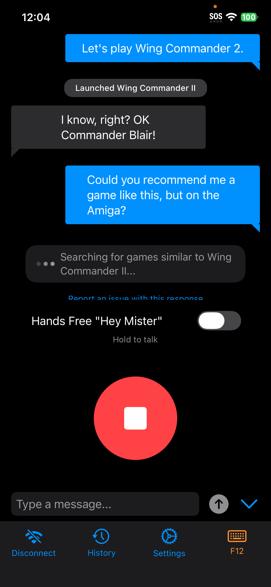
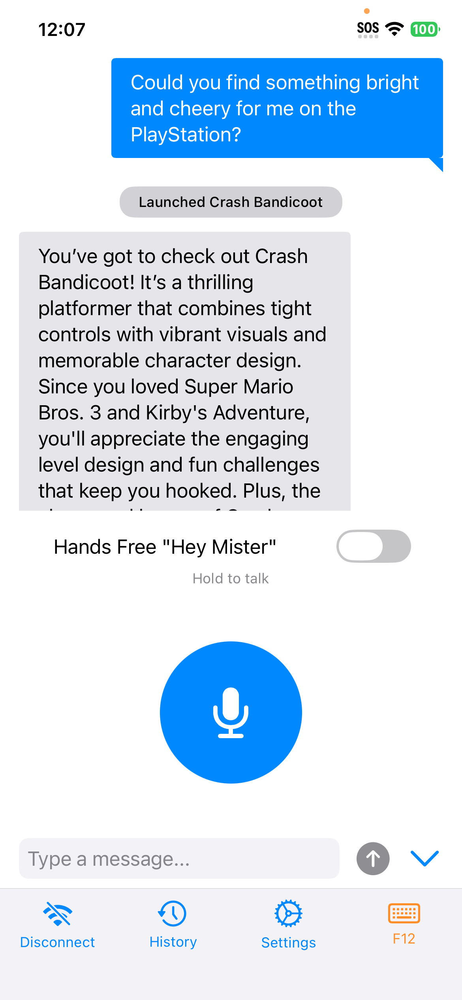
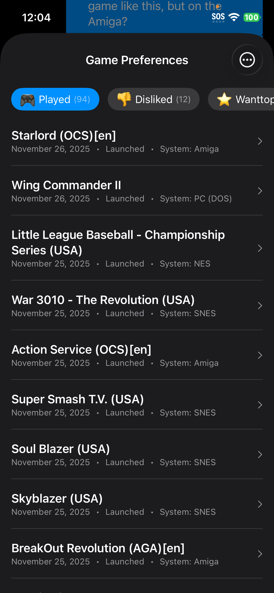
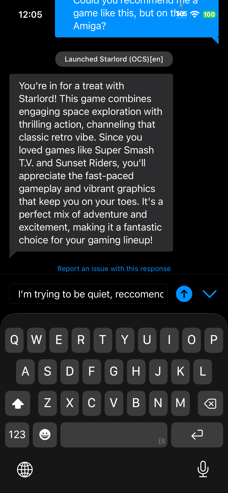
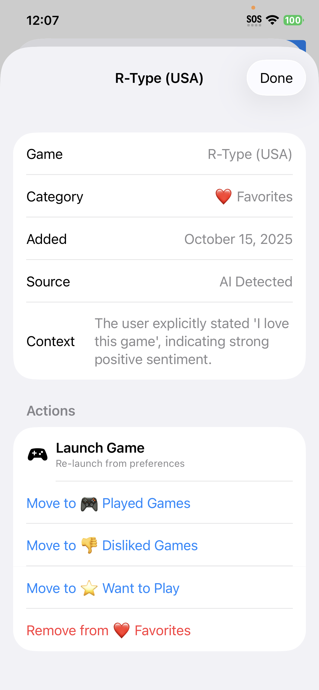

# Cool Uncle

A voice-powered iOS app that provides intelligent game recommendations and seamless control for MiSTer FPGA through natural language conversation.



## What is Cool Uncle?

Cool Uncle is your personal retro gaming assistant. Using voice commands, you can:

- **Launch games by name** - "Let's play Wing Commander 2" or "Play some Contra"
- **Get recommendations** - "Recommend a puzzle game" or "What's a good SNES RPG?"
- **Random selection** - "Play a random NES game" or "Surprise me"
- **Switch to better versions** - Playing Street Fighter 2 Genesis "What's the best version of this game?" swaps to Street Fighter 2 on Arcade
- **Game utilities** - "Save the game", "Load state", "Go to menu"
- **Learn about games** - "When was this released?" or "What's Wood Man's weakness?"

The app remembers your gaming history and preferences, providing personalized recommendations that avoid games you've recently played and favor your favorites.  You can also manually scroll through this list to find games and launch them with just a tap giving you ultimate discovery and control over your massive game library.

## Features

- **Wake Word Detection** _Beta_ - Say "Hey Mister" to activate hands-free voice control
- **Push-to-Talk** - Tap and hold for voice input without wake word
- **Smart Recommendations** - AI-powered game suggestions based on your preferences
- **Game Preferences** - Track favorites, want-to-play lists, and dislikes
- **Multi-System Support** - Works with any system your MiSTer supports
- **Natural Conversation** - Chat naturally about games, get descriptions and history

## Requirements

- **iOS 26.0+** (requires Apple's new Speech framework)
- **MiSTer FPGA** with [Zaparoo](https://github.com/ZaparooProject/zaparoo-core) installed
- **OpenAI API Key** - [Get one here](https://platform.openai.com/api-keys)
- **Xcode 16+** for building

## Quick Start

### 1. Clone the repository

```bash
git clone https://github.com/alexander-mejia/cool-uncle-ios.git
cd cool-uncle-ios
```

### 2. Install dependencies

```bash
# Install CocoaPods if you don't have it
sudo gem install cocoapods

# Install pod dependencies
pod install
```

### 3. Open in Xcode

**Important:** Always open the workspace, not the project file:

```bash
open "Cool Uncle.xcworkspace"
```

### 4. Build and run

1. Select your iOS device (simulator not supported - requires microphone)
2. Build and run (⌘+R)

### 5. Configure the app

1. Open Settings in the app
2. Enter your **OpenAI API Key**
3. Enter your **MiSTer IP Address** (e.g., `192.168.1.100`)
4. Select your preferred **Text-to-Speech Voice**

### 6. Start talking!

- Tap the microphone button and speak, or
- Say "Hey Mister" to activate wake word mode

## Getting an OpenAI API Key

1. Go to [platform.openai.com](https://platform.openai.com)
2. Sign in or create an account
3. Navigate to API Keys section
4. Click "Create new secret key"
5. Copy the key and paste it into Cool Uncle's Settings

**Note:** OpenAI API usage incurs costs. Cool Uncle uses GPT-4o-mini for most operations to minimize costs. Typical usage is a few cents per session.

## MiSTer Setup

Cool Uncle communicates with your MiSTer via the [Zaparoo](https://github.com/ZaparooProject/zaparoo-core) service.

1. Install Zaparoo on your MiSTer
2. Ensure Zaparoo is running (default port: 7497)
3. Make sure your iPhone and MiSTer are on the same network
4. Enter your MiSTer's IP address in Cool Uncle's Settings

## Architecture

Cool Uncle uses a "Three-Call Architecture" for AI interactions:

- **Call A** - Classifies user intent and generates commands
- **Call B** - Generates natural language responses
- **Call C** - Background sentiment analysis for preference learning

The app maintains a state system tracking both "current game" (what's playing) and "recommended game" (pending suggestions).  Unfortunately this only works when you launch games from Cool Uncle.  At the moment launching a game directly using the MiSTer UI does not communicate this back to cool uncle. 

See [ARCHITECTURE.md](ARCHITECTURE.md) for detailed technical documentation.

## Project Structure

```
Cool Uncle/
├── Cool Uncle.xcworkspace   # ← Always open this
├── Cool Uncle/              # Main app source
│   ├── EnhancedOpenAIService.swift  # AI service (Three-Call)
│   ├── ZaparooService.swift         # MiSTer communication
│   ├── SpeechService.swift          # Voice recognition
│   ├── WakeWordKit/                 # Wake word detection
│   └── ConsumerUI/                  # Main user interface
├── Podfile                  # CocoaPods dependencies
└── *.onnx                   # Pre-trained wake word models
```

## Wake Word

The app includes a pre-trained "Hey Mister" wake word model. The ONNX model files are included in the repository and ready to use.  After enabling the Hey Mister toggle switch you can input commands hands free, and it will prevent the device from going to sleep while in this mode.  Perfect for long play sessions where you might have questions about the game, or just saving and loading states hands free.

## Demo

[Watch Cool Uncle in action](https://youtu.be/EHLd2VYgLwQ) (old Debug UI shown)

## Screenshots

| Conversation | Search in Progress | Game History |
|:---:|:---:|:---:|
|  |  |  |

| AI Response (Dark) | Game Details |
|:---:|:---:|
|  |  |

## License

BSD 3-Clause License - see [LICENSE](LICENSE) for details.

Copyright (c) 2025, Alexander Mejia

## Acknowledgments

- [openWakeWord](https://github.com/dscripka/openWakeWord) - Wake word detection framework (Apache 2.0)
- [ONNX Runtime](https://onnxruntime.ai/) - ML inference for wake word detection (MIT)
- [FluidAudio](https://github.com/FluidInference/FluidAudio) - Voice activity detection (Apache 2.0)
- [Zaparoo](https://github.com/ZaparooProject/zaparoo-core) - MiSTer FPGA control
- [MiSTer FPGA](https://github.com/MiSTer-devel) - The amazing retro gaming platform
- OpenAI - GPT models powering the conversational AI

## Contributing

This github repo is up for historical stakes and I will not be taking bug reports or pull requests.  You are free to fork this repo and make any modifications you wish.  Please attribute Alexander Mejia as the creator of the original source code for Cool Uncle.  If you want to use the Cool Uncle name, and launch this on the app store, go ahead.  I just don't have the time to maintain an app on the App store, but want the MiSTer community to have this great improvement to the user experience of MiSTer. 
